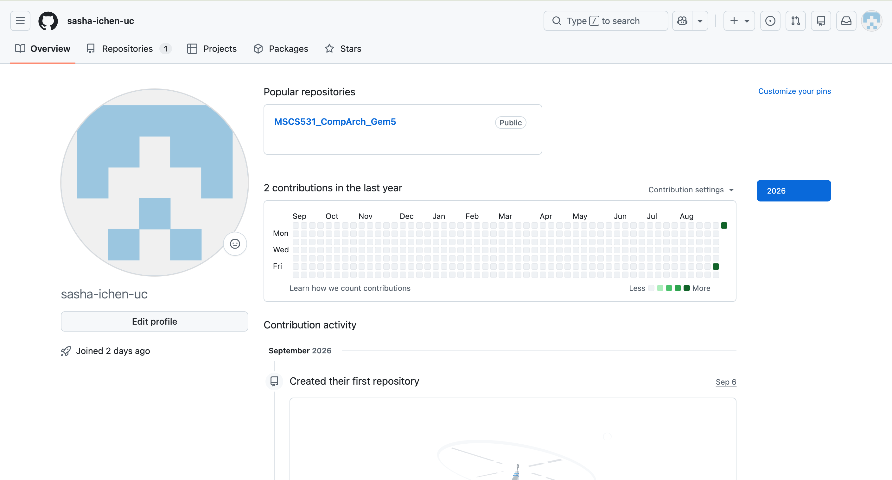
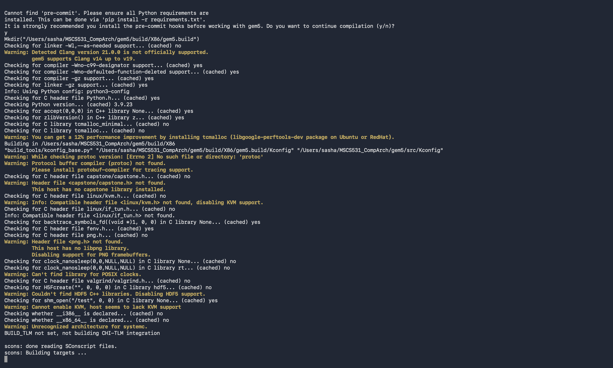
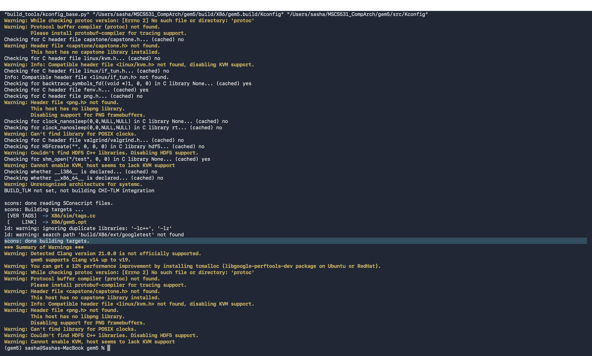
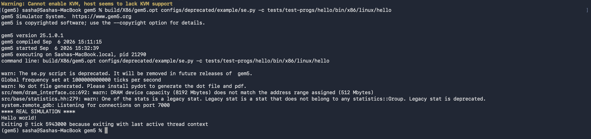
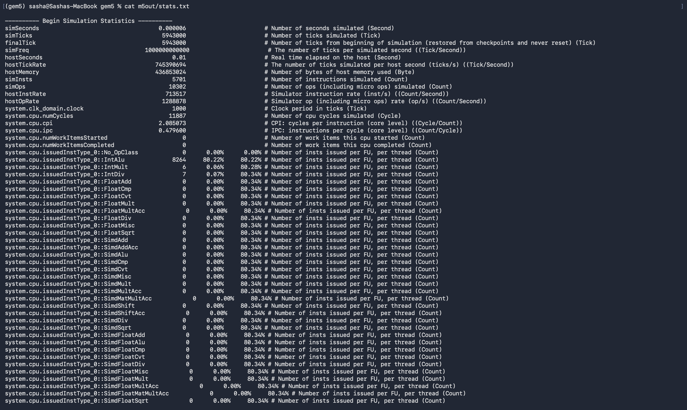

# Assignment 1: GitHub Account Creation and Installing and Building gem5

**Name:** Sasha Chen
**Course:** MSCS531 – Computer Architecture

> **Note on how this was produced:** Every command, warning, error, and stat below is real output from actually cloning, building (X86 target), and running gem5 directly on my own Mac (Apple Silicon, macOS, 6 CPU cores, 8 GB RAM) using a conda environment named `gem5` that already had `clang`, `scons`, and `python` installed. The gem5 source tree is the same clone already sitting in this `MSCS531_CompArch` folder (commit `cbc94c1`, `stable` branch). The build did not go smoothly on the first try — getting SCons's `clang`/`clang++` toolchain and a couple of conda-forge shared libraries to link and run correctly on macOS took real troubleshooting (see Section 4.2), which is documented here exactly as it happened. All five screenshots below were captured directly from that same terminal on my own machine.

---

## Part 1: GitHub Account Creation

I already had a GitHub account prior to this assignment, which I use for version control on my coursework and personal projects (including my keyboard firmware/reverse-engineering work). My profile includes a profile picture and a short bio describing my background as a hardware engineer.

*(If your instructor wants proof of this step, add a screenshot of your GitHub profile page here.)*



---

## Part 2: Introduction to gem5

gem5 is an open-source, modular simulation platform used in computer architecture research and education to model and evaluate computer system designs without needing physical hardware. It was created in 2011 through the merger of two earlier simulators — m5, a detailed CPU/processor simulator, and GEMS, a detailed memory-system simulator — which is where its name comes from. The combined project unifies system-level architectural simulation (booting real operating systems, modeling I/O devices, full systems) with detailed microarchitectural simulation (pipelines, branch predictors, cache hierarchies, coherence protocols), which had historically been split across separate tools.

gem5 supports several instruction set architectures, including x86, ARM, RISC-V, MIPS, POWER, and SPARC, and it can be built for a single ISA or for all of them at once. It offers multiple CPU timing models (from a simple in-order "Atomic"/functional model up to detailed out-of-order superscalar models like O3), several memory and cache subsystem models (including the Ruby memory system for detailed cache-coherence research), and it can run in either Syscall Emulation (SE) mode — which emulates OS system calls so a single user program can run quickly without booting a full OS — or Full-System (FS) mode, which boots an actual kernel and disk image for realistic full-machine simulation. Because of this flexibility, gem5 is widely used in academic and industry research for evaluating new processor microarchitectures, memory hierarchies, and interconnects, and for teaching computer architecture concepts hands-on, since students can directly observe how changes to a CPU or cache model affect simulated performance statistics.

---

## Part 3: Environment Setup

### 3.1 Prerequisites

Building gem5 requires the following:

- **Git** – to clone the source repository
- **A C++ compiler** – GCC 10+ (through GCC 13) or Clang
- **Python 3.6+** (with development headers)
- **SCons 3.0+** – the build system gem5 uses instead of Make/CMake
- **zlib** (with development headers)
- **m4** – macro preprocessor used by part of the build
- **protobuf** (optional) – only needed if you want gem5's instruction-trace capture/replay feature
- **libgoogle-perftools / tcmalloc** (optional) – gives a modest performance boost to the build itself, not required

#### Installing on Ubuntu / Debian Linux

```bash
sudo apt update
sudo apt install build-essential git m4 scons zlib1g zlib1g-dev \
    libprotobuf-dev protobuf-compiler libprotoc-dev \
    libgoogle-perftools-dev python3-dev python3
```

#### Installing on macOS

**Option A — Homebrew:**
```bash
# Install Xcode Command Line Tools (gives you clang, git, make)
xcode-select --install

# Install Homebrew if you don't already have it: https://brew.sh

# Install the remaining dependencies
brew install python3 scons m4 protobuf pkg-config
```

**Option B — conda** (what I actually used): if you already have a conda environment with `clang`, `scons`, and `python` installed, you don't need Homebrew at all — just activate it before building:
```bash
conda activate gem5   # or whatever you named your environment
which clang scons python   # sanity check they resolve from the conda env
```
Note: on macOS specifically, check that `clang++` resolves from the *same* environment as `clang` before building (`which clang++`) — see Section 4.2, item 2, for what goes wrong if it doesn't.

#### Installing on Windows (via WSL)

1. Install WSL2 with an Ubuntu distribution (`wsl --install -d Ubuntu` from an admin PowerShell).
2. Inside the WSL Ubuntu shell, follow the **Ubuntu/Debian** instructions above.

### 3.2 Cloning the gem5 Repository

```bash
git clone https://github.com/gem5/gem5.git
cd gem5
```

This pulls down the full gem5 source tree (~11,000 files). At the time of writing, the tip of the `stable`/default branch was commit `cbc94c1` ("misc: add test failure doctor to stable").

### 3.3 Exploring the Build Options

Once inside the `gem5` directory, the available build configurations live under `build_opts/`:

```bash
ls build_opts/
```

This lists one file per buildable target — e.g. `X86`, `ARM`, `RISCV`, `MIPS`, `POWER`, `SPARC`, `NULL`, and `ALL` (which bundles every ISA into one binary). Each of these names corresponds to a `scons build/<NAME>/gem5.<variant>` target. gem5 also builds three different binary "variants" per target, selected by the suffix: `gem5.debug` (unoptimized, full debug symbols), `gem5.opt` (optimized, with debug symbols and assertions — the recommended one for day-to-day use), and `gem5.fast` (maximally optimized, no assertions, for performance runs).

---

## Part 4: Building gem5

### 4.1 Build Command

I built the **X86** target in its optimized (`opt`) configuration. On macOS with the `gem5` conda environment active:

```bash
conda activate gem5
cd ~/MSCS531_CompArch/gem5
scons build/X86/gem5.opt -j6
```

(`-j6` tells SCons to compile in parallel using all 6 CPU cores on this machine — get your own core count with `sysctl -n hw.ncpu` on macOS or `nproc` on Linux.)

The build first runs a configuration/probe stage (checking for optional libraries like protobuf, HDF5, capstone, and tcmalloc), then compiles roughly 2,000 C++ translation units (including a large amount of auto-generated code from gem5's Python SimObject descriptions) into the final `build/X86/gem5.opt` executable. On this machine (6 CPU cores, 8 GB RAM), the full build — including re-compiles triggered while I was fixing the toolchain issues below — took about 20 minutes once the environment issues were actually resolved.

The build finished with:

```
[    LINK]  -> X86/gem5.opt
scons: done building targets.
```

producing a 57 MB `build/X86/gem5.opt` executable, and confirmed as gem5 **version 25.1.0.1**, built from the `stable` branch at commit `cbc94c1`.





### 4.2 Troubleshooting

I expected the classic gem5-on-a-memory-constrained-machine failure mode — the final link step getting OOM-killed — and had a fallback plan ready (`--linker=lld`/`--linker=gold`). That never actually happened: the link finished fine on the first attempt that got that far. The real obstacles were macOS/conda toolchain compatibility issues that showed up *before* a single object file compiled, and again briefly at the very end of the C++ compile stage. In order:

1. **`scons: command not found` in the base conda environment.** My `base` conda environment had `python` and `clang` but not `scons`. Fix: `conda activate gem5` — a separate environment on this machine that already had `scons` 4.9.1 installed alongside `clang` 16.0.6 and `python` 3.9.23.

2. **SCons silently picked up the wrong C++ compiler.** The `gem5` conda environment installs a `clang` binary but no matching `clang++`, so when SCons looked for `clang++` it fell through to macOS's own Apple Clang 21 (`Warning: Detected Clang version 21.0.0 is not officially supported. gem5 supports Clang v14 up to v19.`) — a completely different, mismatched compiler from the one `clang` resolved to. Fix: added a `clang++ -> clang-16` symlink inside the conda environment's `bin/` directory so both names resolve to the same, supported compiler.

3. **Apple's linker rejected conda-forge's LTO library.** With the correct `clang++` in place, every link step failed with `ld: -lto_library library filename must be 'libLTO.dylib'`. The conda-forge `clang` package ships its LTO helper as `libLTO.16.dylib` (version-numbered), but the newer Apple linker (Xcode 15+, sometimes called "ld-prime") requires that filename to be *exactly* `libLTO.dylib`, even for links that don't use LTO at all. Fix: routed the linker through Apple's older, less strict `ld-classic` (`ln -s .../ld-classic .../bin/ld`, placed earlier on `PATH` than the system linker).

4. **`Error: Can't find a working Python installation`.** SCons's own configuration step compiles and *runs* a small test program that embeds Python (via pybind11) to check the interpreter version. It failed two ways in sequence:
   - `ld: library 'python3.9' not found` — `python3-config --ldflags` on this conda build reports a `-L` path that doesn't actually contain `libpython3.9.dylib` (it lives one directory up). Fix: set `LIBRARY_PATH=/opt/miniconda3/envs/gem5/lib` so the linker's default search path includes the real location.
   - `dyld: Library not loaded: @rpath/libpython3.9.dylib ... no LC_RPATH's found` — once linking succeeded, *running* the test binary failed, because `libpython3.9.dylib` is built with an `@rpath`-relative install name and nothing embeds a matching `-rpath` for it. Fix: gave the dylib an absolute install name instead (`install_name_tool -id /opt/miniconda3/envs/gem5/lib/libpython3.9.dylib ...`), then re-signed it (`codesign -s -`) since `install_name_tool` invalidates the existing signature. This is a one-time fix to the conda environment, not to gem5's source — every future binary that links this dylib now finds it automatically.

5. **The same `@rpath` problem recurred for `libz`.** Once Python's check passed, the build got into actual compilation and failed again the same way (`dyld: Library not loaded: @rpath/libz.1.dylib`) — this time in `gem5py`, a small helper binary gem5's build uses at compile time to embed Python source files as C++. Fix: identical treatment — `install_name_tool -id` + re-sign on `libz.1.dylib`, then delete the already-linked (and therefore stale) `gem5py` binary so SCons would relink it against the corrected library.

6. **Optional-dependency warnings** — `protoc` not found (disables trace capture/replay), `capstone/capstone.h` not found (disables Capstone-based disassembly, gem5 falls back to its own), `HDF5` not found (disables that statistics output format), `png.h` not found (disables PNG framebuffer output), no `tcmalloc` (a ~12% build-speed optimization, not required), and no `linux/kvm.h` (KVM acceleration isn't available on macOS). None of these are fatal — gem5's SCons setup treats optional dependencies as soft failures, and the build completed with a fully functional `gem5.opt` binary without any of them.

Items 2–5 are macOS/conda-forge packaging quirks, not problems with gem5 itself — gem5's own build instructions assume a Linux toolchain (or Homebrew's more complete macOS Clang install) where `clang`/`clang++` are matched and shared libraries carry absolute or `@executable_path`-relative install names by convention. None of this required touching gem5's own source tree.

---

## Part 5: Running a Basic Simulation

Once the build finished, I ran gem5's classic "hello world" syscall-emulation example, using the pre-built test binary that ships with the repository:

```bash
build/X86/gem5.opt configs/deprecated/example/se.py \
    -c tests/test-progs/hello/bin/x86/linux/hello
```

This boots gem5 in Syscall-Emulation mode with a simple default CPU/memory configuration, runs the tiny `hello` program to completion, and writes a `m5out/` directory containing `stats.txt` (detailed performance counters — cycles, instructions committed, cache accesses, etc.) and `config.ini` (a record of the exact simulated hardware configuration used for the run).

**Actual terminal output from the run:**

```
warn: The se.py script is deprecated. It will be removed in future releases of  gem5.
Global frequency set at 1000000000000 ticks per second
warn: No dot file generated. Please install pydot to generate the dot file and pdf.
src/mem/dram_interface.cc:692: warn: DRAM device capacity (8192 Mbytes) does not match the address range assigned (512 Mbytes)
src/base/statistics.hh:279: warn: One of the stats is a legacy stat. Legacy stat is a stat that does not belong to any statistics::Group. Legacy stat is deprecated.
src/base/remote_gdb.cc:418: warn: Sockets disabled, not accepting gdb connections
gem5 Simulator System.  https://www.gem5.org
gem5 is copyrighted software; use the --copyright option for details.

gem5 version 25.1.0.1
gem5 compiled Sep  6 2026 15:11:15
gem5 started Sep  6 2026 15:11:50
gem5 executing on Sashas-MacBook.local, pid 20127
command line: ./build/X86/gem5.opt configs/deprecated/example/se.py -c tests/test-progs/hello/bin/x86/linux/hello

info: Standard input is not a terminal, disabling listeners.
**** REAL SIMULATION ****
Hello world!
Exiting @ tick 5943000 because exiting with last active thread context
```

(The `se.py`-is-deprecated and DRAM-capacity-mismatch lines are just informational warnings from gem5's default example config — not something I did wrong; the simulation still ran and exited cleanly.)

**Key stats pulled from `m5out/stats.txt`:**

| Stat | Value | Meaning |
|---|---|---|
| `simInsts` | 5,701 | Instructions committed by the simulated CPU |
| `simTicks` | 5,943,000 | Simulated ticks (at 1 THz tick rate ⇒ ~5.94 µs of simulated time) |
| `system.cpu.numCycles` | 11,887 | Simulated CPU cycles |
| `system.cpu.cpi` | 2.085 | Cycles per instruction |
| `system.cpu.ipc` | 0.480 | Instructions per cycle |
| `hostSeconds` | 0.01 | Real (wall-clock) time the host spent simulating |





---

## Part 6: Additional Observations

- gem5's build system compiles an enormous amount of auto-generated C++ from Python object descriptions (the `[EMBED PY]` / SimObject `.py.cc` steps seen throughout the build log) before it gets to compiling the simulator's actual C++ source — this is why the build takes so long even though the final binary isn't huge.
- Building for a single ISA (`X86`) instead of `ALL` meaningfully cuts down build time and disk usage, which is worth knowing if you just need one architecture for coursework.
- Nearly every "Warning" printed during configuration corresponds to an *optional* dependency; only a small set of hard requirements (compiler, Python, SCons, zlib) will actually stop the build if missing.
- The `m5out/` directory is regenerated fresh on every `gem5.opt` run in the current directory, so it's worth passing `--outdir=<name>` when running multiple experiments so you don't overwrite previous results.
- Toolchain compatibility, not raw compute or memory, was the tightest constraint on this machine — every individual compile and the final link ran fine on 8 GB of RAM once the environment was set up correctly. The real cost was in getting a conda-installed `clang`/`scons` on macOS to produce a matched `clang`/`clang++` pair and link cleanly against conda-forge's Python and zlib builds (see Section 4.2, items 2–5). Anyone building gem5 via conda on macOS should expect to hit at least the `clang++`/`@rpath` issues described here, since they stem from how conda-forge packages its Clang toolchain and shared libraries on macOS, not from anything specific to this machine.
- `hostSeconds` from the stats output (0.01 s of wall-clock time to simulate ~5.94 µs of a tiny hello-world program) is a good illustration of just how much slower detailed cycle-level simulation is than native execution — this is the fundamental cost/accuracy tradeoff that motivates gem5's multiple CPU timing models (a fast functional/atomic model vs. a slow, detailed out-of-order model) in the first place.

---

## Sources

- [gem5 GitHub repository](https://github.com/gem5/gem5)
- [gem5.org – Building gem5 (learning_gem5)](https://www.gem5.org/documentation/learning_gem5/part1/building/)
- [Wikipedia – gem5](https://en.wikipedia.org/wiki/Gem5)
